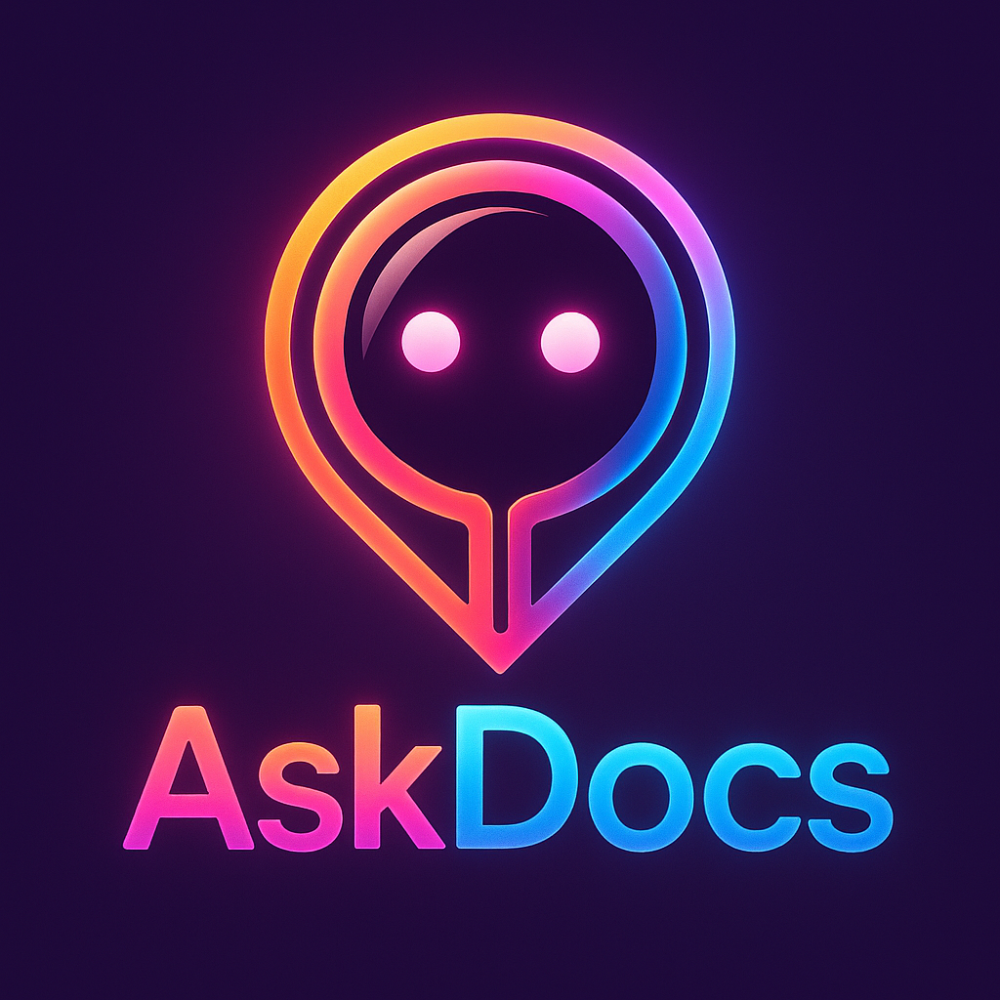
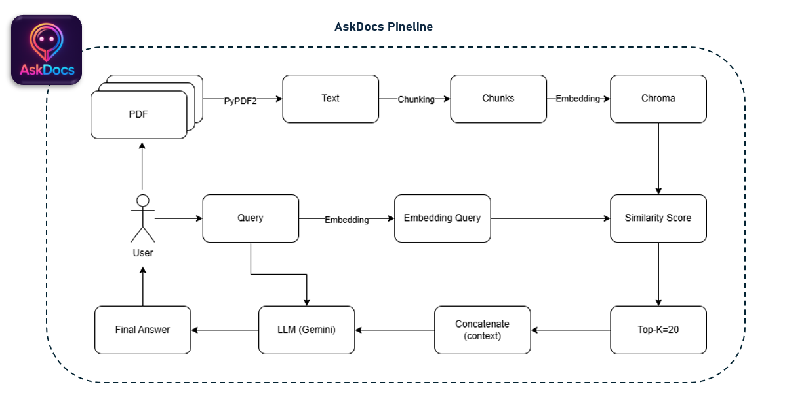

# AskDocs – Basic RAG for Document Q&A

<p align="center">
  
</p>

**AskDocs** is a lightweight **Retrieval-Augmented Generation (RAG)** system designed for document-based question answering. Users can upload PDF files, ask questions, and receive AI-generated answers along with relevant document excerpts.

🔗 **Live Demo:** [AskDocs](https://askdocs-bot.streamlit.app)  

---

## 📌 AskDocs Pipeline

<p align="center">
  
</p>

---

## ✨ Key Features  

✅ **Upload & Process PDFs** – Quickly upload and analyze document content.  
🔍 **Intelligent Retrieval** – Extracts the most relevant sections from documents.  
🧠 **AI-Powered Q&A** – Uses embeddings to enhance search results.  
📑 **Contextual Answers** – Displays document excerpts alongside AI responses.  
🎨 **Minimal & Interactive UI** – Built with Streamlit for a seamless experience.  

---

## 🚀 How It Works  

1️⃣ **Upload a PDF file.**  
2️⃣ **Ask a question** related to the document.  
3️⃣ **The system retrieves** the most relevant text sections.  
4️⃣ **View AI-generated answers** alongside supporting document excerpts.  

---

## 🔧 Technologies Used  

- 🐍 **Python** – Core engine  
- 🌐 **Streamlit** – User-friendly UI  
- 📖 **LangChain + ChromaDB** – Vector-based retrieval system  
- 🤖 **Hugging Face Embeddings** – Semantic search for intelligent responses  

---

## 🛠️ Local Installation  

```bash
# Clone the repository
git clone https://github.com/Vu0401/AskDocs.git

# Navigate to the project directory
cd AskDocs

# Install dependencies
pip install -r requirements.txt

# Run the Streamlit app
streamlit run app.py
```

> ⚠️ **Important:** Before running the app, create a `.env` file in the project directory and add your **GEMINI_API_KEY**:  
> ```  
> GEMINI_API_KEY="your_api_key_here"  
> ```  
> This is required for AI-powered search to function properly.
